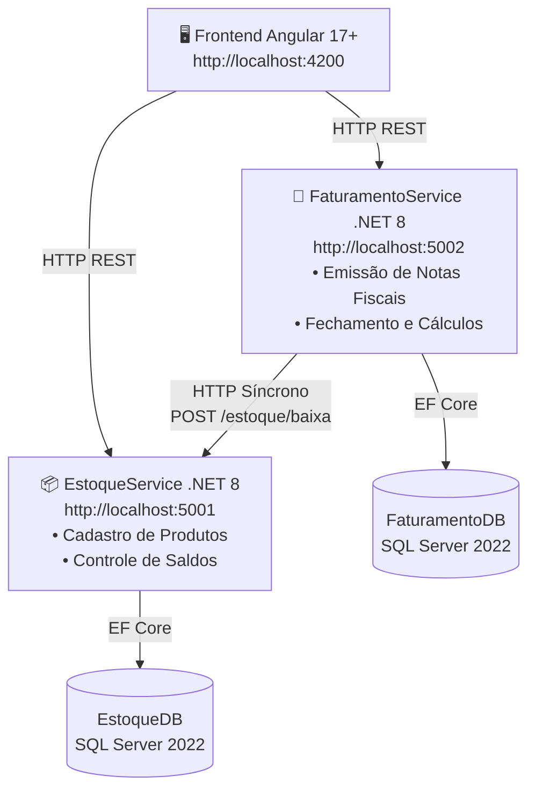
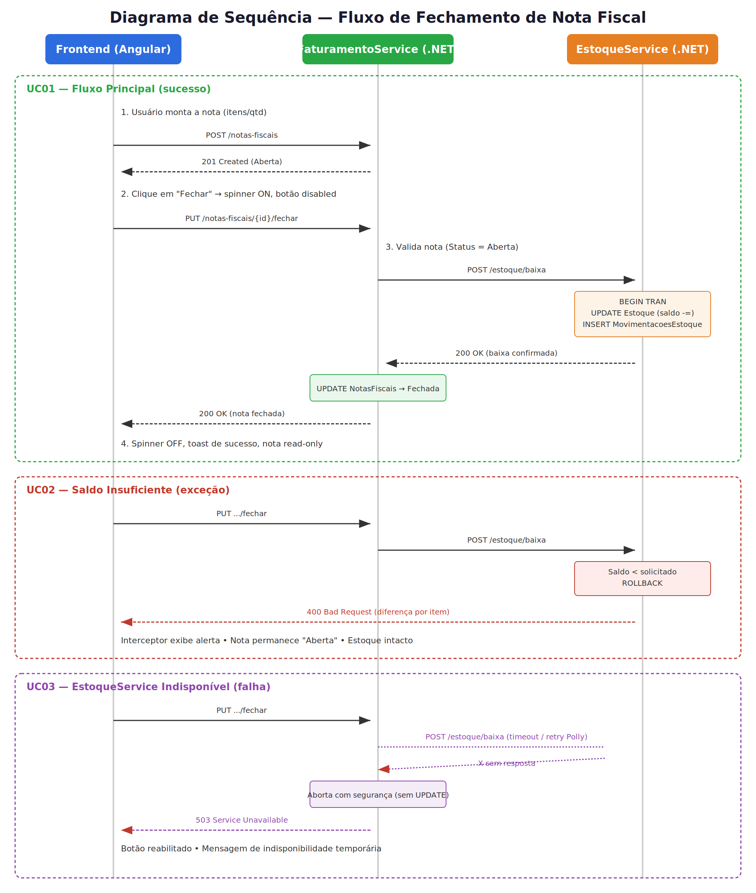

# 🧾 Sistema de Emissão e Gestão de Notas Fiscais — Desafio Técnico Korp


## 🎯 Objetivo e Proposta de Valor

### O problema

Em processos de faturamento, o fechamento de uma nota fiscal e a baixa correspondente no estoque são operações que precisam ser tratadas como uma unidade consistente. Se esses dois passos forem executados de forma isolada, sem validação de saldo ou tratamento de falha entre os serviços envolvidos, o sistema fica vulnerável a inconsistências: notas fechadas sem baixa de estoque, vendas de produtos sem saldo disponível, ou operações travadas quando um dos serviços está indisponível.

### A solução

O projeto implementa esse fluxo como dois **microsserviços desacoplados** em .NET 8 — `EstoqueService` e `FaturamentoService` — cada um com seu próprio banco de dados SQL Server, integrados por uma chamada HTTP síncrona no momento do fechamento da nota.

A aplicação:

* Emite notas fiscais com status inicial **Aberta**.
* No fechamento, o `FaturamentoService` solicita a baixa de estoque ao `EstoqueService` via HTTP.
* Valida o saldo disponível antes de efetivar a baixa, rejeitando a operação com `400 Bad Request` quando o saldo é insuficiente.
* Trata a indisponibilidade do `EstoqueService` retornando `404 Not Found` / `503 Service Unavailable`, sem deixar a nota em estado inconsistente.
* Mantém o frontend em Angular informado do estado da operação em tempo real, com spinner de carregamento e prevenção de duplo clique.

---

## 🛠️ Tecnologias Utilizadas

* **Frontend:** Angular 17+, RxJS (`HttpClient`, `Observables`, `pipes`), Angular Signals, Angular Material (`MatTable`, `MatCard`, `MatButton`, `MatIcon`, `MatProgressSpinner`)
* **Backend:** .NET 8, ASP.NET Core Web API, Entity Framework Core 8
* **Persistência:** SQL Server 2022 (uma base por serviço — `EstoqueDB` e `FaturamentoDB`)
* **Conteinerização:** Docker e Docker Compose

---

## 🏗️ Arquitetura da Solução

A solução é composta por dois microsserviços independentes, cada um com seu próprio banco de dados (padrão *Database per Service*), consumidos por um frontend único em Angular.



> 💡 O diagrama acima é renderizado nativamente pelo GitHub (bloco `mermaid`). Se você estiver visualizando este arquivo fora do GitHub (editor local, VS Code sem extensão, etc.), pode ser que ele apareça apenas como texto — nesse caso, use a extensão *Markdown Preview Mermaid Support* ou visualize diretamente no repositório.

### Descrição dos serviços

| Serviço | Responsabilidade | Porta | Banco de Dados |
|---|---|---|---|
| 🖥️ **Frontend (Angular 17+)** | Interface do usuário: cadastro de produtos, emissão e fechamento de notas fiscais, feedback visual de carregamento e erros. | `4200` | — |
| 📦 **EstoqueService (.NET 8)** | Gestão de produtos e saldo em estoque; expõe endpoint de baixa consumido de forma síncrona pelo `FaturamentoService`. | `5001` | `EstoqueDB` |
| 🧾 **FaturamentoService (.NET 8)** | Emissão, listagem e fechamento de notas fiscais; orquestra a chamada HTTP de baixa de estoque e mantém o status transacional da nota. | `5002` | `FaturamentoDB` |

> A comunicação entre `FaturamentoService` e `EstoqueService` é **HTTP síncrona** (request/response): o fechamento da nota só é confirmado após a confirmação explícita da baixa de estoque, garantindo consistência entre os dois domínios.

---

## 🔄 Fluxo de Integração e Fechamento (Diagrama de Sequência)

O diagrama abaixo detalha, passo a passo, a comunicação entre Frontend, `FaturamentoService` e `EstoqueService` nos três cenários centrais do sistema: fechamento com sucesso, saldo insuficiente e indisponibilidade de serviço.

<p align="center">
  
</p>

---

## 📋 Requisitos do Sistema

### ✅ Requisitos Funcionais

| ID | Descrição |
|---|---|
| **RF01** | Cadastro de produtos, contendo nome/descrição e saldo inicial em estoque. |
| **RF02** | Criação de notas fiscais com numeração sequencial automática e status inicial **Aberta**. |
| **RF03** | Fechamento de nota fiscal, realizando a baixa correspondente no estoque dos itens envolvidos. |
| **RF04** | Validação de saldo disponível no momento do fechamento, impedindo a operação quando a quantidade solicitada for superior ao saldo. |
| **RF05** | Bloqueio de reemissão/reprocessamento de fechamento em notas fiscais já **Fechadas**. |

### 🛡️ Requisitos Não Funcionais

| ID | Descrição |
|---|---|
| **RNF01** | Arquitetura de microsserviços desacoplados, com responsabilidades e bancos de dados independentes por serviço. |
| **RNF02** | Persistência relacional real em SQL Server 2022 (sem bancos em memória ou mocks em produção). |
| **RNF03** | Resiliência a falhas de comunicação entre serviços, com tratamento explícito de `400` (regra de negócio), `404` (recurso não encontrado) e `503` (indisponibilidade de serviço). |
| **RNF04** | Stack completa containerizada e inicializável com um único comando via Docker Compose. |
| **RNF05** | Feedback visual de carregamento (`MatProgressSpinner`) e prevenção de duplo clique/duplo envio em ações críticas. |

---

## 💡 Detalhamento Técnico da Solução

### 🖥️ Frontend (Angular 17+)

* **Ciclo de vida dos componentes:** uso de `ngOnInit` para carregamento inicial de dados (ex.: listagem de produtos e notas fiscais ao entrar na tela).
* **RxJS:** consumo de APIs via `HttpClient`, manipulação de `Observables` e uso de `pipes` (`map`, `catchError`, `finalize`) para tratamento de resposta, erros e finalização de estados de carregamento.
* **Angular Material:** `MatTable` (listagem de produtos/notas), `MatCard` (detalhamento de nota), `MatButton` (ações como "Fechar"/"Imprimir"), `MatIcon` (indicadores visuais de status) e `MatProgressSpinner` (feedback de carregamento durante chamadas HTTP).
* **Angular Signals:** gerenciamento de estado reativo local (ex.: `isLoading`, status da nota atual), reduzindo a necessidade de `ChangeDetectorRef` manual.

### ⚙️ Backend (.NET 8 / C#)

* **Frameworks:** ASP.NET Core Web API para exposição dos endpoints REST e Entity Framework Core 8 como ORM de acesso ao SQL Server.
* **Tratamento de exceções:** middlewares globais padronizam os retornos HTTP (`400 Bad Request`, `404 Not Found`, `503 Service Unavailable`), seguindo o padrão `ProblemDetails` (RFC 7807). No startup dos serviços é aplicada uma política de **retry** para aplicação de *migrations* no SQL Server, aguardando o banco ficar disponível no ambiente Docker.
* **Uso de LINQ:**

  ```csharp
  await _context.Produtos.AnyAsync(p => p.Id == produtoId);              // verificação de existência
  await _context.NotasFiscais.FirstOrDefaultAsync(n => n.Id == id);      // recuperação de nota específica
  itens.Select(i => new ItemDto { ... });                                // projeção para DTO
  itens.Sum(i => i.Quantidade * i.PrecoUnitario);                        // cálculo do valor total
  ```

---

## 🚀 Como Executar o Projeto

### Pré-requisitos

Antes de executar o projeto, certifique-se de ter instalado:

* [Docker Desktop](https://www.docker.com/products/docker-desktop/), em execução

### 📥 1. Clonar o Repositório

```bash
git clone https://github.com/Maiquel-Devs/Korp_Teste_MaiquelMafra.git
cd Korp_Teste_MaiquelMafra
```

### 🐳 2. Subir a Stack com Docker Compose

```bash
docker compose up --build -d
```

Esse comando sobe o frontend, os dois microsserviços e os respectivos bancos de dados SQL Server em containers.

### 🌐 3. Acessar os Serviços

| Serviço | URL |
|---|---|
| 🖥️ Frontend (Angular) | http://localhost:4200 |
| 📦 Swagger — EstoqueService | http://localhost:5001/swagger |
| 🧾 Swagger — FaturamentoService | http://localhost:5002/swagger |

---

## 🧪 Roteiro Rápido de Testes

### 1️⃣ Fluxo Principal (Sucesso)

1. Criar um produto com saldo inicial em estoque.
2. Criar uma nota fiscal contendo esse produto (status inicial **Aberta**).
3. Fechar a nota fiscal — observar o spinner de carregamento e a mudança de status para **Fechada**.
4. Conferir, na tela/API de estoque, que o saldo do produto foi devidamente debitado.

### 2️⃣ Fluxo de Exceção (Saldo Insuficiente)

1. Criar uma nota fiscal com quantidade **maior** que o saldo disponível em estoque.
2. Tentar fechar a nota.
3. Validar a exibição do alerta de saldo insuficiente e confirmar que a nota permanece **Aberta** (sem alteração no estoque).

### 3️⃣ Fluxo de Falha (Estoque Indisponível)

1. Derrubar o container do serviço de estoque:

   ```bash
   docker stop estoque-api
   ```

2. Tentar fechar uma nota fiscal.
3. Validar a mensagem de indisponibilidade temporária (**503 Service Unavailable**) e a manutenção do status **Aberta** da nota.

---

## 🎬 Demonstração em Vídeo

O vídeo demonstrando o funcionamento do sistema, a arquitetura de microsserviços e a explicação do código pode ser acessado no link abaixo:

👉 [Assistir à demonstração no Google Drive](https://drive.google.com/file/d/1Myic9J9brfj2Y5Uq4orGAHgJwnyjtqd8/view?usp=sharing)

---

## 👨‍💻 Autor

**Maiquel Mafra**

Estudante de Engenharia de Software e desenvolvedor interessado em backend, arquitetura de software, observabilidade, automação e inteligência artificial aplicada ao desenvolvimento de sistemas.

**GitHub:** [Maiquel-Devs](https://github.com/Maiquel-Devs)

---

## 📄 Licença

Este projeto está disponível sob a **licença MIT**, definida no arquivo [`LICENSE`](LICENSE).